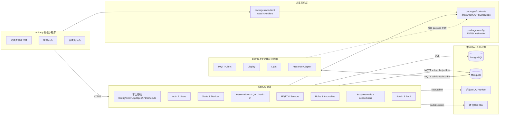
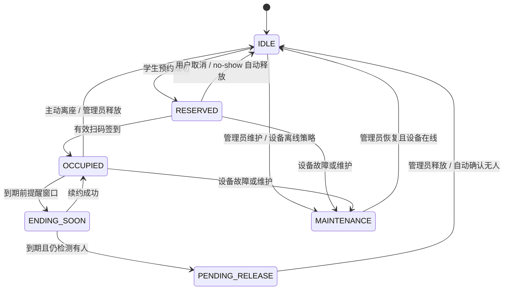

# SmartSeat 实施计划

> 本文档是 SmartSeat 项目的任务真源。产品需求以 [`docs/PRD.md`](PRD.md) 为准，演示口径以 [`docs/DEMO.md`](DEMO.md) 为准，编码约束以根目录 [`AGENTS.md`](../AGENTS.md) 为准。本文档的作用不是重复 PRD，而是把需求、架构、模块边界、任务、验收证据串成可执行计划。

## 1. 完成判定规则

项目只有在以下条件同时满足时，才允许标记为“项目所有功能完成”：

1. `docs/PRD.md` 中所有 P0/P1 功能点均已映射到本计划中的至少一个任务。
2. 本计划中所有 P0/P1 任务状态均为 `Done`。
3. 每个任务均有唯一对应的 `docs/CHECKLIST.md` 核查条目。
4. 每个任务的核查条目均完成“通用完成宏”和“任务专属核查项”。
5. 每个任务均填写证据路径，包括代码路径、测试命令、测试结果、截图/日志/API 文档/演示记录。
6. 登录、预约、扫码签到、设备状态同步、传感器异常、管理员释放、学习统计、匿名排行榜、演示重置等端到端链路均通过发布闸门。
7. 所有明确列入风险清单的开放项均已关闭、降级、延期或已记录处理结论。

任何单个任务完成，不等价于功能完成。任务完成必须以对应 Checklist 通过为准；功能完成必须以相关任务、端到端链路与发布闸门共同通过为准。

## 2. 当前仓库基线

当前仓库已完成 monorepo 与目录骨架、ADR 决策包、共享契约/API client 基线、NestJS 后端平台基础、API-DB-01 的 Prisma schema/migration/seed/数据库访问封装，以及准生产单机 Docker 部署子集；认证、预约业务、真实 MQTT、小程序页面、设备模拟器闭环和固件业务仍未实现。API-DB-01 已在 Docker/PostgreSQL 可用后完成实库迁移、seed 幂等和数据库集成测试核验。后续任务必须以此事实为基线，不得假设已有隐藏实现。

| 区域 | 当前状态 | 后续计划含义 |
|---|---|---|
| 根工程 | 已有 pnpm workspace、根 `package.json`、基础 lint/format 配置 | 可继续保持 TypeScript monorepo 组织方式 |
| `docs/PRD.md` | 已定义角色、登录、状态机、MQTT、终端、小程序、后端、数据模型、流程、非功能需求 | 作为唯一需求基线 |
| `docs/PLAN.md` | 已重构为任务真源，SHR-01、API-PLT-01 与 API-DB-01 已完成；OPS-01 的准生产单机 Docker 部署子集已实现但任务未整体完成 | 后续任务按依赖继续推进；OPS-01 仍需 SIM-01、完整 reset-demo 和端到端演示证据后才能标记 Done |
| `docs/CHECKLIST.md` | 已建立任务级核查清单，并记录 SHR-01/API-PLT-01/API-DB-01 证据 | 后续任务完成时继续补证据路径 |
| `apps/api` | 已有 NestJS 平台层：配置校验、统一错误、请求日志、OpenAPI、ScheduleModule、增强版 `/health`；已补 Prisma 数据模型、migration、seed、数据库访问封装和 Docker API 镜像 | 认证、预约业务模块、真实 MQTT 接入仍需后续任务实现 |
| `apps/miniapp` | `pages.json` 为空，页面目录仅有占位 | 需要先实现页面注册、壳层、登录与角色路由 |
| `apps/device-simulator` | 仅输出初始化提示 | 需要实现 MQTT 设备模拟与演示场景驱动 |
| `packages/contracts` | 已提供共享状态枚举、REST DTO、错误码、分页/时间模型、MQTT topic 与 payload | 后续接口、状态机或 MQTT 契约变更必须继续同步 |
| `packages/api-client` | 已提供 typed client 方法边界、transport 注入、base URL/token 注入与统一错误归一化 | 后续 API-PLT/OpenAPI 与业务接口落地后绑定真实 endpoint |
| `firmware/smart-seat-terminal` | ESP-IDF 目录骨架，组件目录为空 | 需要先建立组件边界，再实现 Wi-Fi/MQTT/显示/灯光/传感器适配 |
| `infra` | 本地 PostgreSQL + Mosquitto；准生产单机 compose 已覆盖 API、PostgreSQL、Mosquitto、一次性 migrate + seed init；Mosquitto 当前允许匿名 | 适合本地联调和单机准生产部署验证；正式安全策略、TLS、备份、监控需另行配置 |
| `scripts` | 仅占位 | 需要补齐启动、seed、reset-demo、演示脚本 |

## 3. 任务状态与执行规则

### 3.1 任务状态

| 状态 | 含义 |
|---|---|
| `Not Started` | 尚未开始 |
| `In Progress` | 正在实现，未达到 Checklist 完成条件 |
| `Blocked` | 因外部凭据、硬件、架构决策或依赖任务阻塞 |
| `Done` | 对应 Checklist 已全部通过，证据路径已填写 |

### 3.2 优先级

| 优先级 | 含义 |
|---|---|
| `P0` | 初赛与核心闭环必须完成；未完成则项目不可判定完成 |
| `P1` | 完整产品体验必须完成；若初赛前无法完成，必须在风险清单中明确降级说明 |
| `P2` | 增强项或后续正式化交付项；不阻塞初赛演示，但不得影响 P0/P1 |

### 3.3 编码智能体任务边界

编码智能体任务边界已迁移至根目录 [`AGENTS.md`](../AGENTS.md) 的“当前基线与编码任务边界”小节统一维护。

执行本计划中的任何任务时，均以 `AGENTS.md` 中对应章节为准；本计划不再重复维护该约束全文，避免双份规则漂移。

## 4. 架构基线

### 4.1 总体架构

### 4.2 模块职责

| 模块 | 责任 | 禁止事项 |
|---|---|---|
| `packages/contracts` | 定义枚举、DTO、错误码、MQTT topic 与 payload、分页模型 | 禁止依赖后端业务实现或小程序 UI |
| `packages/api-client` | 封装 typed HTTP client 与认证头注入 | 禁止写页面状态、业务状态机 |
| `apps/api/src/common` | 配置、错误、日志、鉴权装饰器、OpenAPI、通用工具 | 禁止塞入具体业务规则 |
| `apps/api/src/modules/auth` | 微信/OIDC 登录、系统 token、角色、首个管理员引导 | 禁止在前端保存 secret；禁止绕过后端鉴权 |
| `apps/api/src/modules/seats` | 座位、设备聚合查询与可用性派生 | 禁止创建预约、处理签到 |
| `apps/api/src/modules/reservations` | 预约状态机、二维码 token、签到、续约、离座、到期 | 禁止处理传感器驱动细节 |
| `apps/api/src/modules/mqtt/devices/sensors/anomalies/jobs` | MQTT 接入、设备在线、传感器记录、自动规则、异常事件 | 禁止实现页面 UI |
| `apps/api/src/modules/admin` | 管理员看板、手动释放、维护、配置、审计日志 | 禁止暴露 secret 明文 |
| `apps/api/src/modules/study-records/leaderboard` | 学习记录、个人统计、匿名排行榜 | 禁止泄露真实身份 |
| `apps/miniapp` | 页面、路由、交互、扫码、调用 typed client | 禁止复制后端状态机逻辑；禁止保存 secret |
| `apps/device-simulator` | 以 MQTT 模拟终端心跳、传感器、事件、命令接收 | 禁止改变后端业务规则 |
| `firmware/smart-seat-terminal` | 真实终端 Wi-Fi/MQTT/显示/灯光/传感器适配 | 禁止在终端裁决预约有效性 |
| `infra` 与 `scripts` | 本地依赖、seed、reset-demo、演示启动、证据采集 | 禁止伪装为生产部署能力 |

### 4.3 核心状态机

### 4.4 核心功能链路

| 链路 | 可信判定点 | 主责模块 | 参与模块 | 必过任务 |
|---|---|---|---|---|
| 登录与角色路由 | 后端签发 token 与返回角色 | Auth | Miniapp、Contracts | SHR-01、API-AUTH-01/02/03、MINI-01 |
| 座位查看与预约 | 后端座位聚合视图与预约状态机 | Seats / Reservations | Miniapp | API-SEAT-01、API-RES-01、MINI-02 |
| 动态二维码与扫码签到 | 后端 QRToken 校验与状态流转 | Reservations | Firmware、MQTT、Miniapp | API-RES-03、API-IOT-01、FW-02、MINI-02 |
| 设备在线与状态同步 | 后端设备状态与 MQTT 命令 | MQTT / Devices | Firmware、Simulator | API-IOT-01、FW-01/02、SIM-01 |
| 传感器异常 | 后端传感器持续时间规则 | Sensors / Anomalies / Jobs | Admin、Miniapp | API-IOT-02、API-IOT-03、API-ADM-01、MINI-03 |
| 管理员释放与维护 | 后端管理员鉴权与审计日志 | Admin | Reservations、IoT | API-ADM-01、MINI-03 |
| 学习统计与匿名榜 | 后端有效学习记录规则 | Study Records / Leaderboard | Miniapp | API-STAT-01、MINI-02 |
| 初赛演示 | seed/reset-demo 与脚本证据 | Ops / QA | 全模块 | OPS-01、QA-01 |

## 5. 需求—任务追踪矩阵

| PRD 范围 | 功能/约束 | 主任务 | 辅助任务 | Checklist |
|---|---|---|---|---|
| 1.1–1.4 | 项目范围、初赛 1 个终端、小程序体验版 | GOV-01 | OPS-01、QA-01 | CL-GOV-01、CL-OPS-01、CL-QA-01 |
| 2.1–2.6 | 用户角色、统一入口、微信/OIDC、权限 | API-AUTH-01、API-AUTH-02、API-AUTH-03、MINI-01 | SHR-01 | CL-API-AUTH-01/02/03、CL-MINI-01 |
| 3.1–3.5 | 系统架构、通信链路、MQTT topic | SHR-01、API-IOT-01、FW-01、SIM-01 | OPS-01 | CL-SHR-01、CL-API-IOT-01、CL-FW-01、CL-SIM-01 |
| 4.1–4.2 | 座位、设备、可用性、预约状态 | SHR-01、API-DB-01、API-SEAT-01、API-RES-01 | API-RES-02 | CL-SHR-01、CL-API-DB-01、CL-API-SEAT-01、CL-API-RES-01 |
| 4.3–4.4 | 签到窗口、动态二维码 | API-RES-03 | MINI-02、FW-02 | CL-API-RES-03、CL-MINI-02、CL-FW-02 |
| 4.5–4.7 | 毫米波检测、占用异常、管理员释放 | API-IOT-02、API-IOT-03、API-ADM-01 | FW-01、MINI-03 | CL-API-IOT-02/03、CL-API-ADM-01、CL-FW-01、CL-MINI-03 |
| 4.8–4.9 | 预约未到、匿名排行榜 | API-IOT-03、API-STAT-01 | MINI-02、MINI-03 | CL-API-IOT-03、CL-API-STAT-01、CL-MINI-02/03 |
| 5.1–5.8 | 智能座位终端、显示、灯光、MQTT、本地异常 | FW-01、FW-02 | API-IOT-01、SIM-01 | CL-FW-01、CL-FW-02、CL-API-IOT-01、CL-SIM-01 |
| 6.1–6.14 | 小程序公共、学生、管理员、隐私 | MINI-01、MINI-02、MINI-03 | API-AUTH-*、API-RES-*、API-ADM-01 | CL-MINI-01/02/03 |
| 7.1–7.8 | 后端认证、状态机、MQTT、异常、管理、学生接口 | API-PLT-01、API-DB-01、API-AUTH-*、API-SEAT-01、API-RES-*、API-IOT-*、API-ADM-01、API-STAT-01 | SHR-01 | 对应全部 API 类 Checklist |
| 8.1–8.10 | 数据模型 | API-DB-01 | SHR-01、OPS-01 | CL-API-DB-01 |
| 9.1–9.10 | 核心流程 | QA-01 | 全部 P0/P1 功能任务 | CL-QA-01、发布闸门 |
| 10.1–10.5 | 可用性、可靠性、安全、性能、扩展性 | API-PLT-01、OPS-01、QA-01 | 全部任务 | CL-API-PLT-01、CL-OPS-01、CL-QA-01 |

## 6. 任务总表

| ID | 名称 | 模块 | 优先级 | 前置任务 | 状态 |
|---|---|---|---|---|---|
| GOV-01 | 需求追踪矩阵与完成性治理 | 文档/治理 | P0 | 无 | Done |
| GOV-02 | ADR 决策包 | 架构/治理 | P0 | GOV-01 | Done |
| SHR-01 | 共享契约与 API Client 基线 | packages | P0 | GOV-01 | Done |
| API-PLT-01 | 后端平台基础 | apps/api | P0 | GOV-02、SHR-01 | Done |
| API-DB-01 | 数据模型、迁移与 seed 基线 | apps/api | P0 | GOV-02、SHR-01 | Done |
| API-AUTH-01 | 登录模式配置、用户角色与首个管理员引导 | apps/api | P0 | API-PLT-01、API-DB-01 | Done |
| API-AUTH-02 | 微信登录闭环 | apps/api | P0 | API-AUTH-01 | Not Started |
| API-AUTH-03 | OIDC 登录闭环 | apps/api | P0 | API-AUTH-01 | Not Started |
| API-SEAT-01 | 座位/设备查询聚合 | apps/api | P0 | API-DB-01、SHR-01 | Not Started |
| API-RES-01 | 预约创建、冲突校验与取消 | apps/api | P0 | API-SEAT-01 | Not Started |
| API-RES-02 | 续约、主动离座与到期结束 | apps/api | P0 | API-RES-01 | Not Started |
| API-IOT-01 | MQTT 接入、设备在线状态与命令总线 | apps/api | P0 | API-PLT-01、API-DB-01、SHR-01 | Not Started |
| API-RES-03 | 动态二维码与扫码签到 | apps/api | P0 | API-RES-01、API-IOT-01、SHR-01 | Not Started |
| API-IOT-02 | 传感器接入与持续时间判断 | apps/api | P0 | API-IOT-01 | Not Started |
| API-IOT-03 | 调度任务、自动规则与异常事件 | apps/api | P0 | API-IOT-02、API-RES-02 | Not Started |
| API-ADM-01 | 管理员接口、手动释放、维护与审计 | apps/api | P0 | API-IOT-03、API-SEAT-01 | Not Started |
| API-STAT-01 | 学习记录、个人统计与匿名排行榜 | apps/api | P1 | API-RES-02、API-ADM-01 | Not Started |
| MINI-01 | 小程序公共壳层、登录页与角色路由 | apps/miniapp | P0 | SHR-01、API-AUTH-01 | Not Started |
| MINI-02 | 学生页面闭环 | apps/miniapp | P0 | MINI-01、API-SEAT-01、API-RES-01/02/03、API-STAT-01 | Not Started |
| MINI-03 | 管理员页面闭环 | apps/miniapp | P0 | MINI-01、API-ADM-01、API-IOT-03 | Not Started |
| FW-01 | 固件基础与传感器适配抽象 | firmware | P0 | GOV-02、SHR-01 | Not Started |
| FW-02 | 屏幕、灯光与状态同步 | firmware | P0 | FW-01、API-IOT-01、API-RES-03 | Not Started |
| SIM-01 | 设备模拟器闭环 | apps/device-simulator | P1 | SHR-01、API-IOT-01 | Not Started |
| OPS-01 | 本地基础设施、seed 与 demo reset | infra/scripts | P0 | API-DB-01、SIM-01 | In Progress |
| QA-01 | 测试、E2E、演示证据与发布闸门 | 全局 | P0 | 核心功能任务基本完成 | Not Started |

## 7. 详细任务说明

### GOV-01 需求追踪矩阵与完成性治理

| 字段 | 内容 |
|---|---|
| 目标 | 建立 PRD 到任务、Checklist、证据路径的追踪关系，使计划文件成为项目任务真源。 |
| 非目标 | 不改业务代码；不重写 PRD；不做 UI 或后端实现。 |
| 前置条件 | 已读取 `docs/PRD.md`、`docs/DEMO.md`、`docs/PLAN.md`、`docs/CHECKLIST.md`、`AGENTS.md`。 |
| 输入 | 当前文档、研究报告、仓库目录现状。 |
| 输出 | 重构后的 `docs/PLAN.md`、`docs/CHECKLIST.md` 中的完成判定、追踪矩阵、任务 ID 体系。 |
| 涉及文件/目录 | `docs/PLAN.md`、`docs/CHECKLIST.md`。 |
| 接口契约 | 无。 |
| 数据变更 | 无。 |
| 测试要求 | 检查每个 PRD 大章均有任务覆盖；检查所有 Task ID 均有 Checklist ID。 |
| 文档要求 | 明确“完成计划全部任务 = 项目功能完成”的判定条件。 |
| 部署/配置要求 | 无。 |
| 回滚要求 | 保留旧版计划文档备份或通过 Git 回滚。 |
| 监控与告警 | 无。 |
| 验收标准 | PRD、任务、Checklist、证据路径之间不存在孤儿项；P0/P1 范围清晰。 |
| 可分配给编码智能体的提示 | 只修改 `docs/PLAN.md` 与 `docs/CHECKLIST.md`；建立任务 ID、Checklist ID 与追踪矩阵；不要改任何业务代码。 |

### GOV-02 ADR 决策包

| 字段 | 内容 |
|---|---|
| 目标 | 固化影响实现边界的关键架构决策，减少编码智能体在实现时自行选型。 |
| 非目标 | 不实现业务功能；不引入实际依赖，除非 ADR 明确要求。 |
| 前置条件 | GOV-01 完成。 |
| 输入 | PRD、README、现有 package 配置、研究报告风险清单。 |
| 输出 | `docs/adrs/` 下的 ADR，或 `docs/PLAN.md` 中 ADR 区块。至少覆盖 ORM、测试框架、OpenAPI 输出、CI/CD、部署目标、传感器型号占位策略、MQTT 设备认证、微信/OIDC 凭据管理。 |
| 涉及文件/目录 | `docs/adrs/*`、`docs/PLAN.md`。 |
| 接口契约 | 无。 |
| 数据变更 | 无。 |
| 测试要求 | ADR 需满足字段完整性与覆盖核查；每个 ADR 有状态、决策、理由、影响范围、回滚方式。 |
| 文档要求 | 每个开放技术点必须标明“已决策 / 暂定 / 待决策”。 |
| 部署/配置要求 | 记录后续任务需要的环境变量与密钥来源，不写真实值。 |
| 回滚要求 | ADR 变更以新 ADR 或 supersede 方式记录，不直接抹除历史。 |
| 监控与告警 | 无。 |
| 验收标准 | 编码智能体无需自行判断 ORM、测试框架、设备认证、安全边界等关键选型。 |
| 可分配给编码智能体的提示 | 只补充 ADR 文档；不要修改源码；将未决事项归入风险清单并标注决策人。 |

### SHR-01 共享契约与 API Client 基线

| 字段 | 内容 |
|---|---|
| 目标 | 将跨端状态、DTO、错误码、MQTT topic/payload、typed API client 收敛到共享包。 |
| 非目标 | 不实现后端业务规则；不实现小程序页面；不连接真实 MQTT。 |
| 前置条件 | GOV-01 完成。 |
| 输入 | PRD 状态定义、数据模型、接口草案、MQTT 主题规划。 |
| 输出 | `packages/contracts` 的枚举、DTO、错误码、MQTT payload；`packages/api-client` 的方法签名、请求封装、错误模型；client 采用 transport 注入，SHR-01 不提前固化 REST path，后续由 OpenAPI operation 绑定真实 endpoint。 |
| 涉及文件/目录 | `packages/contracts/src/**`、`packages/api-client/src/**`。 |
| 接口契约 | REST DTO、分页模型、错误响应模型、MQTT topic/payload 类型；API client 方法按 auth、me、seats、devices、reservations、checkin、anomalies、stats、leaderboard、admin 分组暴露 typed 边界。 |
| 数据变更 | 无。 |
| 测试要求 | TypeScript 类型检查；为关键 DTO/payload 提供类型级或简单运行时测试。 |
| 文档要求 | 在 contracts/api-client README 或源码注释中说明状态含义、topic 命名、错误码、transport 注入与 OpenAPI-first 边界。 |
| 部署/配置要求 | 无。 |
| 回滚要求 | 契约变更需版本说明；不得无提示删除字段。 |
| 监控与告警 | 无。 |
| 验收标准 | API、miniapp、simulator 后续可从 contracts 引入核心状态、DTO、错误码和 MQTT payload；api-client 提供 typed 方法边界、base URL/token 注入和统一错误处理；TypeScript 类型检查通过。 |
| 可分配给编码智能体的提示 | 只改 shared packages；补齐枚举、DTO、错误码、MQTT payload 与 API client 方法签名；不要实现页面和后端业务逻辑。 |

### API-PLT-01 后端平台基础

| 字段 | 内容 |
|---|---|
| 目标 | 建立 NestJS 后端的配置校验、统一错误格式、日志、鉴权基础、OpenAPI、调度模块、健康检查。 |
| 非目标 | 不实现具体预约、登录、MQTT 业务规则。 |
| 前置条件 | GOV-02、SHR-01 完成。 |
| 输入 | `.env.example`、NestJS 骨架、contracts 错误码。 |
| 输出 | `common/` 基础设施、配置模块、全局异常过滤器、请求日志、OpenAPI 输出、ScheduleModule 初始化、基础用户上下文装饰器、增强版 `/health`。 |
| 涉及文件/目录 | `apps/api/src/**`、`apps/api/package.json`、`apps/api/README.md`。 |
| 接口契约 | `GET /health`、`GET /docs`、`GET /openapi.json`、统一错误响应格式。 |
| 数据变更 | 无。 |
| 测试要求 | 配置缺失启动失败测试；错误格式测试；health 接口测试；OpenAPI JSON smoke 测试。 |
| 文档要求 | `apps/api/README.md` 记录后端启动说明、环境变量说明、OpenAPI 访问方式和无真实依赖探活边界。 |
| 部署/配置要求 | 使用 `.env` + `.env.example` fallback 读取既有占位变量；本任务未新增环境变量，`production` 环境拒绝占位 secret。 |
| 回滚要求 | 可恢复到原 `/health` 骨架；配置项新增需可禁用。 |
| 监控与告警 | 日志包含 request id、method、path、status、duration；health 暴露数据库/MQTT 配置状态占位。 |
| 验收标准 | 后端启动时环境变量可校验；错误响应统一；OpenAPI 可通过 `/docs` 与 `/openapi.json` 访问；调度模块可注册任务；本任务不连接数据库或 MQTT。 |
| 可分配给编码智能体的提示 | 只实现平台层能力；不要写任何业务状态机；补齐配置校验、全局错误、日志、Swagger/OpenAPI、ScheduleModule 和基础测试。 |

### API-DB-01 数据模型、迁移与 seed 基线

| 字段 | 内容 |
|---|---|
| 目标 | 落地 PRD 数据模型、迁移、索引、约束、seed 与基础仓储访问。 |
| 非目标 | 不实现登录、预约、MQTT 或页面逻辑。 |
| 前置条件 | GOV-02、SHR-01 完成。 |
| 输入 | PRD 第 8 章数据模型、ADR 中 ORM 决策。 |
| 输出 | User、AuthConfig、Seat、Device、DeviceSeatBinding、Reservation、QRToken、CheckInRecord、SensorReading、AnomalyEvent、MaintenanceRecord、StudyRecord、AdminActionLog 模型；迁移脚本；seed 数据；基础 repository/service。 |
| 涉及文件/目录 | `apps/api/prisma/**`、`apps/api/src/common/database/**`、`apps/api/src/modules/database-baseline/**`、`apps/api/src/__tests__/api-db-*.ts`。 |
| 接口契约 | 无外部接口；内部 repository/service 契约。 |
| 数据变更 | 新建核心业务表、索引、唯一约束、外键、枚举字段。 |
| 测试要求 | 迁移可执行；seed 可重复运行；关键唯一约束与外键约束测试。 |
| 文档要求 | 说明数据库初始化、迁移、回滚、seed 命令。 |
| 部署/配置要求 | 数据库连接环境变量进入 `.env.example`。 |
| 回滚要求 | 每个 migration 有明确 down/rollback 策略或等价说明。 |
| 监控与告警 | 记录 migration/seed 执行日志。 |
| 验收标准 | PRD 第 8 章所有实体均有模型；演示所需 1 个终端、座位、学生、管理员测试数据可 seed。 |
| 可分配给编码智能体的提示 | 按 ADR 选定 ORM 实现 schema、migration 和 seed；不要实现业务接口；准备最小演示数据和约束测试。 |
| 当前状态 | Done；Docker/PostgreSQL 可用后已补跑实库 migration、seed 幂等、基础查询和数据库集成测试。 |
| 证据路径 | 代码：`apps/api/prisma/schema.prisma`、`apps/api/prisma/migrations/20260502000000_api_db_01_baseline/migration.sql`、`apps/api/prisma/seed.ts`、`apps/api/src/common/database/prisma.service.ts`、`apps/api/src/modules/database-baseline/seed-baseline.service.ts`；测试：`apps/api/src/__tests__/api-db-enums.spec.ts`、`apps/api/src/__tests__/api-db.integration.spec.ts`；文档：`apps/api/README.md`。 |
| 已执行核验 | `pnpm install` 通过；`pnpm --filter @smartseat/api db:generate` 通过；`pnpm --filter @smartseat/api test` 通过；`RUN_DATABASE_TESTS=1 pnpm --filter @smartseat/api test` 通过，读取 Docker PostgreSQL seed 数据；`pnpm --filter @smartseat/api typecheck` 通过；`pnpm lint` 通过；`pnpm typecheck` 通过；`pnpm format` 通过；`pnpm docker:config` 通过；`pnpm docker:build` 通过；`pnpm docker:up` 通过；`docker compose --env-file .env.deploy -f infra/docker-compose.deploy.yml run --rm api-db-init` 第二次通过，输出 `No pending migrations to apply` 与 `API-DB-01 seed complete: users=4, seats=1, devices=1, study_records=4`；`curl http://localhost:3000/health` 返回 database `available`；`curl http://localhost:3000/openapi.json` 返回 OpenAPI JSON。 |
| 阻塞核验 | 无。首次镜像构建曾遇到 Docker Hub `node:24-alpine` metadata EOF，重试后成功；该问题归类为外部镜像仓库网络抖动。 |

### API-AUTH-01 登录模式配置、用户角色与首个管理员引导

| 字段 | 内容 |
|---|---|
| 目标 | 实现登录模式配置、用户角色模型、匿名名、`/me`、首个登录用户成为管理员的基础规则。 |
| 非目标 | 不实现具体微信 code 换 openid；不实现 OIDC 授权码回调。 |
| 前置条件 | API-PLT-01、API-DB-01 完成。 |
| 输入 | PRD 2.1–2.6、7.3.1、AuthConfig/User 模型。 |
| 输出 | `auth`、`users` 模块基础接口；管理员配置登录模式接口；用户身份上下文；Bearer token 签发/解析守卫。 |
| 涉及文件/目录 | `apps/api/src/modules/auth/**`、`apps/api/src/modules/users/**`、`apps/api/src/common/auth/**`、`apps/api/src/common/config/**`、`apps/api/src/app.module.ts`、`apps/api/src/__tests__/api-auth.spec.ts`、`packages/contracts/src/api.ts`、`.env.example`、`apps/api/package.json`。 |
| 接口契约 | `GET /auth/mode`、`PUT /admin/auth/mode`、`GET /me`。 |
| 数据变更 | AuthConfig 默认记录按 `DEFAULT_AUTH_MODE` 初始化；User 角色与匿名名字段读写；登录模式变更写入 AdminActionLog；不新增 Prisma schema 或 migration。 |
| 测试要求 | 首个用户引导仅发生一次；普通用户不能改登录模式；secret 字段不明文返回。 |
| 文档要求 | 说明登录模式、角色、首个管理员规则、脱敏返回格式、内部初始化服务边界。 |
| 部署/配置要求 | 使用 `jose` 实现 HS256 JWT；`AUTH_TOKEN_SECRET`、`AUTH_TOKEN_TTL_SECONDS`、`DEFAULT_AUTH_MODE` 写入 `.env.example`；production 禁止 token secret 占位值。 |
| 回滚要求 | 支持恢复默认登录模式；不删除用户数据。 |
| 监控与告警 | 登录模式变更写入 AdminActionLog；首个管理员初始化写结构化服务日志。 |
| 验收标准 | 后端可识别 STUDENT/ADMIN；`/me` 返回角色路由所需信息；系统无用户时首个登录用户可成为管理员。 |
| 可分配给编码智能体的提示 | 只做登录模式、角色、`/me`、首个管理员引导；不要实现微信/OIDC 换码；必须补权限与脱敏测试。 |
| 当前状态 | Done；已实现登录模式读取/管理员修改、脱敏 AuthConfig 返回、Bearer token 签发/解析、管理员守卫、`/me` 角色路由字段、首个用户成为管理员的内部初始化规则。 |
| 证据路径 | 代码：`apps/api/src/modules/auth/**`、`apps/api/src/modules/users/**`、`apps/api/src/common/auth/**`、`apps/api/src/common/config/api-env.ts`、`apps/api/src/app.module.ts`、`packages/contracts/src/api.ts`、`.env.example`、`apps/api/package.json`；测试：`apps/api/src/__tests__/api-auth.spec.ts`、`apps/api/src/__tests__/api-env.spec.ts`；文档：`docs/PLAN.md`、`docs/CHECKLIST.md`。 |
| 已执行核验 | `pnpm --filter @smartseat/api test` 通过；`pnpm --filter @smartseat/api typecheck` 通过；`pnpm lint` 通过；`pnpm typecheck` 通过；`pnpm format` 通过。 |
| 阻塞核验 | 无；本任务未启动 Docker 或真实微信/OIDC 联调。 |

### API-AUTH-02 微信登录闭环

| 字段 | 内容 |
|---|---|
| 目标 | 实现微信 code 换 openid、用户映射、一键注册/登录、系统 token 签发。 |
| 非目标 | 不实现 OIDC；不实现小程序 UI。 |
| 前置条件 | API-AUTH-01 完成。 |
| 输入 | 微信登录配置、PRD 2.4、7.3.2。 |
| 输出 | 微信 provider、`POST /auth/wechat/login`、用户注册/登录逻辑、错误映射。 |
| 涉及文件/目录 | `apps/api/src/modules/auth/**`、`apps/api/src/modules/users/**`、`packages/contracts` 必要 DTO。 |
| 接口契约 | `POST /auth/wechat/login`，输入 code，输出 token、user、role、nextRoute。 |
| 数据变更 | User 增加/更新微信 openid 映射。 |
| 测试要求 | 新用户注册、老用户登录、微信接口失败、登录模式不匹配、首个管理员规则。 |
| 文档要求 | 说明微信环境变量、错误码、测试 mock 方式。 |
| 部署/配置要求 | `WECHAT_APP_ID`、`WECHAT_APP_SECRET` 等写入 `.env.example`。 |
| 回滚要求 | 可关闭微信登录模式；已创建用户保留。 |
| 监控与告警 | 记录登录成功/失败计数，不记录 openid 明文到普通日志。 |
| 验收标准 | 微信模式下支持一键注册/登录；登录后返回角色路由信息；失败场景有明确错误码。 |
| 可分配给编码智能体的提示 | 使用可替换 provider 封装微信接口；只做后端登录闭环；不要改前端页面；补齐 mock 测试。 |

### API-AUTH-03 OIDC 登录闭环

| 字段 | 内容 |
|---|---|
| 目标 | 实现 OIDC 授权发起、回调换码、subject 映射、系统 token 签发与 OIDC 模式权限规则。 |
| 非目标 | 不实现微信登录；不在前端保存 `client_secret`；不提供 OIDC 模式注册入口。 |
| 前置条件 | API-AUTH-01 完成。 |
| 输入 | 学校 OIDC Provider 配置、PRD 2.5、7.3.3。 |
| 输出 | `GET /auth/oidc/start`、`GET /auth/oidc/callback`、OIDC provider 封装、用户映射。 |
| 涉及文件/目录 | `apps/api/src/modules/auth/**`、contracts auth DTO。 |
| 接口契约 | start 返回授权地址或重定向信息；callback 返回系统 token 或可被小程序消费的结果。 |
| 数据变更 | User 增加/更新 oidc subject 映射。 |
| 测试要求 | state 校验、回调失败、未授权用户、已存在 subject、登录模式不匹配、secret 不出后端。 |
| 文档要求 | 说明 issuer、client id、client secret、redirect uri、scope 配置。 |
| 部署/配置要求 | OIDC 相关环境变量写入 `.env.example`，真实 secret 不入库。 |
| 回滚要求 | 可关闭 OIDC 模式；保留用户映射。 |
| 监控与告警 | 登录失败率、回调失败原因、provider 不可达日志。 |
| 验收标准 | OIDC 模式下通过学校身份源登录；不出现注册入口；secret 仅后端使用；角色路由信息完整。 |
| 可分配给编码智能体的提示 | 采用后端持有 secret 的授权码流；只做 start/callback 与 subject 映射；不要改 UI；必须补安全与失败用例。 |

### API-SEAT-01 座位/设备查询聚合

| 字段 | 内容 |
|---|---|
| 目标 | 输出学生页与管理员页共用的座位/设备聚合视图，计算业务状态、可用性和不可用原因。 |
| 非目标 | 不创建预约；不处理签到；不处理传感器事件。 |
| 前置条件 | API-DB-01、SHR-01 完成。 |
| 输入 | Seat、Device、Reservation 状态；PRD 4.1。 |
| 输出 | `/seats`、`/seats/:id`、`/admin/seats` 查询接口。 |
| 涉及文件/目录 | `apps/api/src/modules/seats/**`、`apps/api/src/modules/devices/**`。 |
| 接口契约 | 学生视图隐藏管理字段；管理员视图包含设备、异常、维护状态字段。 |
| 数据变更 | 无，或仅更新派生缓存字段。 |
| 测试要求 | 空闲、已预约、使用中、维护、离线、不可预约原因组合测试。 |
| 文档要求 | 说明派生状态计算规则和字段含义。 |
| 部署/配置要求 | 无。 |
| 回滚要求 | 聚合视图可退回基础字段返回，不影响数据。 |
| 监控与告警 | 查询错误日志包含 seat_id、user_id、role。 |
| 验收标准 | 学生能看到可预约状态；管理员能看到座位与设备聚合信息；派生状态与 PRD 一致。 |
| 可分配给编码智能体的提示 | 只做查询聚合和展示态计算；不要实现预约创建；为学生/管理员分别输出最小必要字段。 |

### API-RES-01 预约创建、冲突校验与取消

| 字段 | 内容 |
|---|---|
| 目标 | 实现预约创建、有效预约冲突校验、签到窗口计算、签到前取消。 |
| 非目标 | 不实现扫码签到；不实现续约；不实现排行榜。 |
| 前置条件 | API-SEAT-01 完成。 |
| 输入 | PRD 6.5、7.4、Reservation 模型。 |
| 输出 | `POST /reservations`、`DELETE /reservations/:id` 或 cancel 接口、预约状态机基础服务。 |
| 涉及文件/目录 | `apps/api/src/modules/reservations/**`。 |
| 接口契约 | 创建预约 DTO、取消 DTO、错误码：冲突、无权限、座位不可用、非法时间。 |
| 数据变更 | Reservation 创建、取消、状态流转。 |
| 测试要求 | 同座位冲突、同用户冲突、不可用座位、取消权限、重复取消、边界时间。 |
| 文档要求 | 说明预约规则、冲突规则、取消规则。 |
| 部署/配置要求 | 可配置默认预约时长、签到窗口参数。 |
| 回滚要求 | 新接口可禁用；预约数据可保留。 |
| 监控与告警 | 记录预约创建成功数、冲突拒绝数、取消数。 |
| 验收标准 | 学生可预约空闲座位；冲突被拒绝；取消后状态一致回退。 |
| 可分配给编码智能体的提示 | 只实现创建/取消；不要实现扫码签到；补齐冲突、重复预约、取消边界测试。 |

### API-RES-02 续约、主动离座与到期结束

| 字段 | 内容 |
|---|---|
| 目标 | 实现使用中续约、用户主动离座、正常到期结束、到期有人进入 `PENDING_RELEASE` 的基础状态流转。 |
| 非目标 | 不实现二维码签到；不实现管理员异常页。 |
| 前置条件 | API-RES-01 完成。 |
| 输入 | PRD 6.8、6.9、9.7。 |
| 输出 | 续约接口、主动离座接口、到期处理服务、学习记录触发点。 |
| 涉及文件/目录 | `apps/api/src/modules/reservations/**`、`apps/api/src/modules/study-records/**` 必要接口。 |
| 接口契约 | `POST /reservations/:id/extend`、`POST /current-usage/release`、当前使用查询。 |
| 数据变更 | Reservation 状态、结束时间、StudyRecord 初始生成。 |
| 测试要求 | 续约冲突、续约成功、无权限离座、重复离座、到期无人/有人分支。 |
| 文档要求 | 说明续约、离座、到期状态流转。 |
| 部署/配置要求 | 到期扫描窗口可配置。 |
| 回滚要求 | 可禁用续约入口；保留主动离座和读接口。 |
| 监控与告警 | 记录续约成功/失败、主动离座、到期处理数量。 |
| 验收标准 | 使用中学生可续约或主动离座；离座生成学习记录；到期规则与 PRD 一致。 |
| 可分配给编码智能体的提示 | 只处理续约/离座/到期；不要写异常页面；保证状态机幂等并补齐单测。 |

### API-IOT-01 MQTT 接入、设备在线状态与命令总线

| 字段 | 内容 |
|---|---|
| 目标 | 后端接入 MQTT，接收设备心跳，维护在线状态，下发 display/light/command。 |
| 非目标 | 不实现传感器持续时间判断；不实现异常引擎。 |
| 前置条件 | API-PLT-01、API-DB-01、SHR-01 完成。 |
| 输入 | PRD 3.4、3.5、5.7；contracts MQTT payload。 |
| 输出 | MQTT client service、topic subscribe/publish、设备在线/离线状态服务、命令总线。 |
| 涉及文件/目录 | `apps/api/src/modules/mqtt/**`、`apps/api/src/modules/devices/**`。 |
| 接口契约 | `seat/{device_id}/heartbeat`、display/light/command topic。 |
| 数据变更 | Device 在线状态、最后心跳时间、命令发送记录可选。 |
| 测试要求 | 心跳更新、75 秒离线判定、重连后状态同步、非法 device_id、payload 校验失败。 |
| 文档要求 | 说明 topic、payload、QoS/retain 策略、设备认证暂定方案。 |
| 部署/配置要求 | MQTT broker URL、用户名、密码、client id、超时阈值写入 `.env.example`。 |
| 回滚要求 | 可关闭 MQTT 连接，系统降级为模拟状态。 |
| 监控与告警 | 心跳延迟、离线设备数、payload 校验失败、MQTT 重连日志。 |
| 验收标准 | 后端可接收心跳、判定离线、向设备下发最新显示/灯光命令；恢复在线后重放状态。 |
| 可分配给编码智能体的提示 | 只做 MQTT 接入、设备状态与命令总线；不要实现异常引擎；保留设备鉴权扩展点。 |

### API-RES-03 动态二维码与扫码签到

| 字段 | 内容 |
|---|---|
| 目标 | 实现 QRToken 生成、刷新、失效、一次性使用和扫码签到闭环。 |
| 非目标 | 不实现排行榜；不实现管理员页面。 |
| 前置条件 | API-RES-01、API-IOT-01、SHR-01 完成。 |
| 输入 | PRD 4.3、4.4、6.6、7.4、8.6。 |
| 输出 | QRToken 持久化、`POST /checkin`、display payload 中 token 下发、失败错误码。 |
| 涉及文件/目录 | `apps/api/src/modules/reservations/**`、`packages/contracts/**`。 |
| 接口契约 | `POST /checkin`、`GET /current-usage`、MQTT display payload。 |
| 数据变更 | QRToken 表；Reservation `checked_in_at`、状态变更。 |
| 测试要求 | token 过期、重复签到、非本人签到、超出签到窗口、设备离线、已取消预约。 |
| 文档要求 | OpenAPI、错误码、扫码流程图、token TTL 与刷新周期说明。 |
| 部署/配置要求 | token TTL、刷新周期、签名密钥或随机生成策略可配置。 |
| 回滚要求 | 可关闭签到入口；QRToken 表可回滚；读状态不受影响。 |
| 监控与告警 | token 生成数、签到成功/失败率、重复签到异常数。 |
| 验收标准 | 终端显示动态二维码；学生扫码后后端校验成功并切换为 `OCCUPIED`；失败场景返回明确错误。 |
| 可分配给编码智能体的提示 | 在 reservations 模块内实现 token 生成/校验/签到；不要实现排行榜或管理员页面；同步 contracts 与 OpenAPI。 |

### API-IOT-02 传感器接入与持续时间判断

| 字段 | 内容 |
|---|---|
| 目标 | 接收 presence 上报，统一抽象人体存在状态，并实现持续时间窗口判断。 |
| 非目标 | 不实现管理员页面；不实现固件具体驱动。 |
| 前置条件 | API-IOT-01 完成。 |
| 输入 | PRD 4.5、5.5、5.7.2；传感器型号未确定的适配层要求。 |
| 输出 | `sensors` 模块、SensorReading 持久化、presence evaluator。 |
| 涉及文件/目录 | `apps/api/src/modules/sensors/**`、`apps/api/src/modules/mqtt/**`。 |
| 接口契约 | `PRESENT/ABSENT/UNKNOWN/ERROR` payload 与校验规则。 |
| 数据变更 | SensorReading 写入；可选座位当前 presence 派生状态。 |
| 测试要求 | PRESENT 持续 60 秒、ABSENT 持续 5 分钟、UNKNOWN/ERROR 持续 2 分钟、抖动数据不误判。 |
| 文档要求 | 说明 raw_value、统一状态、阈值、传感器适配边界。 |
| 部署/配置要求 | 持续时间阈值可配置。 |
| 回滚要求 | 可停用 presence 规则，仅保留原始记录。 |
| 监控与告警 | payload 校验失败、传感器错误状态、长时间 UNKNOWN。 |
| 验收标准 | 后端可稳定记录传感器上报，并按持续时间形成可信 presence 判断。 |
| 可分配给编码智能体的提示 | 只做 presence 抽象、持久化和持续时间判断；不要写前端页面；保留 `raw_value` 调试字段。 |

### API-IOT-03 调度任务、自动规则与异常事件

| 字段 | 内容 |
|---|---|
| 目标 | 实现 no-show、ending soon、设备离线 reconcile、空闲占用、提前离座、到期仍有人等自动规则与异常事件。 |
| 非目标 | 不实现管理员 UI；不实现固件驱动。 |
| 前置条件 | API-IOT-02、API-RES-02 完成。 |
| 输入 | PRD 4.6、4.8、7.6、9.4–9.9。 |
| 输出 | scheduled jobs、AnomalyEvent 生成与状态流转、自动释放逻辑、终端状态同步触发。 |
| 涉及文件/目录 | `apps/api/src/jobs/**`、`apps/api/src/modules/anomalies/**`、`apps/api/src/modules/reservations/**`。 |
| 接口契约 | 内部任务；异常查询接口可留给 API-ADM-01。 |
| 数据变更 | Reservation 状态、AnomalyEvent、no-show 记录或字段、设备离线异常。 |
| 测试要求 | no-show 自动释放、ENDING_SOON 切换、空闲有人、使用中无人、到期有人、离线/恢复幂等。 |
| 文档要求 | 说明每个定时任务周期、幂等条件、异常类型和状态。 |
| 部署/配置要求 | 任务周期、阈值进入 `.env.example`。 |
| 回滚要求 | 可逐项关闭自动规则；关闭后不破坏人工释放能力。 |
| 监控与告警 | 任务执行时长、扫描数量、异常生成数量、任务失败日志。 |
| 验收标准 | 自动规则能覆盖 PRD 核心异常；任务重复执行不产生重复异常或错误状态。 |
| 可分配给编码智能体的提示 | 基于 ScheduleModule 实现周期任务；只做规则扫描与状态落库；不要做小程序页面。 |

### API-ADM-01 管理员接口、手动释放、维护与审计

| 字段 | 内容 |
|---|---|
| 目标 | 实现管理员看板、座位/设备/异常/no-show 查询、手动释放、维护切换、系统配置与审计日志。 |
| 非目标 | 不实现小程序页面；不暴露 secret 明文。 |
| 前置条件 | API-IOT-03、API-SEAT-01 完成。 |
| 输入 | PRD 6.13、7.7、9.8、AdminActionLog 模型。 |
| 输出 | `/admin/*` 接口、管理员鉴权、审计日志、手动释放与维护接口。 |
| 涉及文件/目录 | `apps/api/src/modules/admin/**`、`apps/api/src/modules/anomalies/**`、相关业务模块。 |
| 接口契约 | 管理员接口 DTO；释放原因必填；配置返回脱敏字段。 |
| 数据变更 | AdminActionLog；Reservation/Seat/Device/AnomalyEvent 状态更新。 |
| 测试要求 | 普通用户拒绝访问；释放原因必填；维护/恢复；异常处理；审计日志字段完整。 |
| 文档要求 | 说明管理员接口、权限、审计字段、脱敏策略。 |
| 部署/配置要求 | 无新增 secret；配置接口只写非敏感字段或通过后端安全写入。 |
| 回滚要求 | 管理员变更操作可通过日志追溯；维护状态可恢复。 |
| 监控与告警 | 管理员敏感操作日志；异常处理失败日志。 |
| 验收标准 | 管理员可查看和处理座位/设备/异常/no-show；手动释放同步终端；关键操作留痕。 |
| 可分配给编码智能体的提示 | 只做管理员接口与审计；确保全部走管理员鉴权；补齐 release、handle anomaly、maintenance 测试。 |

### API-STAT-01 学习记录、个人统计与匿名排行榜

| 字段 | 内容 |
|---|---|
| 目标 | 生成有效学习记录，并提供个人统计、本周到馆次数、累计学习时长、连续学习天数和匿名排行榜。 |
| 非目标 | 不做前端视觉实现；不泄露真实身份。 |
| 前置条件 | API-RES-02、API-ADM-01 完成。 |
| 输入 | PRD 4.9、6.11、6.12、9.10。 |
| 输出 | StudyRecord 服务、`/stats/me`、`/leaderboard`、榜单 opt-in/out。 |
| 涉及文件/目录 | `apps/api/src/modules/study-records/**`、`apps/api/src/modules/leaderboard/**`。 |
| 接口契约 | 个人统计 DTO、排行榜 DTO、匿名名字段、排名字段。 |
| 数据变更 | StudyRecord 写入；User 榜单参与偏好。 |
| 测试要求 | `<15` 分钟无效记录过滤、跨天连续天数、本周统计、匿名显示、退出榜单、本人排名可见。 |
| 文档要求 | 说明有效学习规则、榜单指标、匿名策略。 |
| 部署/配置要求 | 周期统计可实时计算或定时缓存，需在 ADR/文档说明。 |
| 回滚要求 | 可关闭排行榜展示，不删除学习记录。 |
| 监控与告警 | 统计查询耗时、榜单生成失败日志。 |
| 验收标准 | 学生可查看个人统计与匿名排行榜；榜单不展示真实身份。 |
| 可分配给编码智能体的提示 | 只做记录与统计接口；不要做前端视觉；补齐 opt-in/out、无效记录过滤、匿名排名测试。 |

### MINI-01 小程序公共壳层、登录页与角色路由

| 字段 | 内容 |
|---|---|
| 目标 | 补齐 uni-app 页面注册、公共布局、登录页、token 管理、角色路由、API client 接入。 |
| 非目标 | 不实现学生业务页；不实现管理员业务页。 |
| 前置条件 | SHR-01、API-AUTH-01 完成。 |
| 输入 | `pages.json`、PRD 6.2、6.3。 |
| 输出 | `pages.json` 页面清单、登录页、路由守卫、store、API client 封装。 |
| 涉及文件/目录 | `apps/miniapp/pages.json`、`apps/miniapp/src/pages/auth/**`、`stores/**`、`router/**`、`api/**`。 |
| 接口契约 | 调用 `/auth/mode`、`/me`，预留微信/OIDC 登录入口。 |
| 数据变更 | 本地 token 与用户信息存储。 |
| 测试要求 | 未登录跳转、登录后按角色进入、退出登录、token 过期处理。 |
| 文档要求 | 说明页面清单、路由规则、登录模式 UI 行为。 |
| 部署/配置要求 | 小程序 API base URL 配置。 |
| 回滚要求 | 可回退到单页登录占位，不影响后端。 |
| 监控与告警 | 前端错误提示与 API 错误码映射日志。 |
| 验收标准 | 所有页面注册；学生和管理员共用一个入口；登录后按后端角色路由。 |
| 可分配给编码智能体的提示 | 只做公共壳层、登录与路由；不要实现学生/管理员业务页面；使用 api-client，不要手写散乱 fetch。 |

### MINI-02 学生页面闭环

| 字段 | 内容 |
|---|---|
| 目标 | 实现学生首页、座位详情、预约、扫码签到、当前使用、续约、主动离座、统计、排行榜、我的页面。 |
| 非目标 | 不实现管理员页面；不在前端裁决后端状态。 |
| 前置条件 | MINI-01、API-SEAT-01、API-RES-01、API-RES-02、API-RES-03、API-STAT-01 完成或可 mock。 |
| 输入 | PRD 6.4–6.12、API client。 |
| 输出 | `src/pages/student/**` 页面、学生 store、错误提示矩阵、扫码调用。 |
| 涉及文件/目录 | `apps/miniapp/src/pages/student/**`、`stores/**`、`utils/**`。 |
| 接口契约 | 座位列表/详情、预约、取消、签到、当前使用、续约、离座、stats、leaderboard。 |
| 数据变更 | 仅本地 UI 状态；业务数据经 API。 |
| 测试要求 | 预约到签到主链路、续约、离座、no-show 展示、错误码提示、榜单匿名。 |
| 文档要求 | 学生操作流程、页面路由、错误提示映射。 |
| 部署/配置要求 | 微信扫码 API 或体验版兼容处理。 |
| 回滚要求 | 可降级隐藏统计/榜单，不影响预约签到主链路。 |
| 监控与告警 | 前端 API 失败提示、扫码失败提示。 |
| 验收标准 | 学生能完成座位查看、预约、扫码签到、续约、主动离座，并查看统计、榜单和 no-show。 |
| 可分配给编码智能体的提示 | 只做学生链路页面；不要实现管理员页面；严格将后端错误码映射为用户可理解提示。 |

### MINI-03 管理员页面闭环

| 字段 | 内容 |
|---|---|
| 目标 | 实现管理员首页、座位管理、设备管理、异常事件、no-show、系统配置、手动释放与维护操作。 |
| 非目标 | 不实现学生页面；不保存或展示 secret 明文。 |
| 前置条件 | MINI-01、API-ADM-01、API-IOT-03 完成。 |
| 输入 | PRD 6.13、管理员 API。 |
| 输出 | `src/pages/admin/**` 页面、管理员操作表单、审计原因输入。 |
| 涉及文件/目录 | `apps/miniapp/src/pages/admin/**`、`stores/**`、`api/**`。 |
| 接口契约 | `/admin/*` 接口；释放原因必填；配置页只显示脱敏状态。 |
| 数据变更 | 仅本地 UI 状态；业务数据经 API。 |
| 测试要求 | 普通学生不可访问；手动释放；维护/恢复；异常处理；登录模式切换；secret 不展示。 |
| 文档要求 | 管理员页面说明、权限说明、操作风险说明。 |
| 部署/配置要求 | 无真实 secret；配置修改通过后端安全接口。 |
| 回滚要求 | 可禁用高风险操作按钮，仅保留只读看板。 |
| 监控与告警 | 管理员操作失败提示；接口拒绝访问提示。 |
| 验收标准 | 管理员可查看座位、设备、异常、no-show，可手动释放并填写原因，可配置登录模式。 |
| 可分配给编码智能体的提示 | 只做管理员页面；不要在前端保存 secret；配置页只展示脱敏状态和非敏感字段。 |

### FW-01 固件基础与传感器适配抽象

| 字段 | 内容 |
|---|---|
| 目标 | 建立 ESP-IDF component 边界，完成 Wi-Fi/MQTT/时间同步基础、display/light/presence 抽象接口。 |
| 非目标 | 不实现完整业务状态渲染；不绑定未确定传感器型号的不可替换代码。 |
| 前置条件 | GOV-02、SHR-01 完成。 |
| 输入 | 固件骨架、PRD 5.1–5.8、硬件占位信息。 |
| 输出 | `components/display`、`components/light`、`components/mqtt`、`components/presence_sensor` 的接口与基础实现。 |
| 涉及文件/目录 | `firmware/smart-seat-terminal/**`。 |
| 接口契约 | presence 输出统一为 `PRESENT/ABSENT/UNKNOWN/ERROR`；MQTT payload 与 contracts 一致。 |
| 数据变更 | 无。 |
| 测试要求 | 可编译；组件接口测试或最小 smoke test；mock presence 输出。 |
| 文档要求 | 固件组件边界、配置项、接线占位、传感器适配说明。 |
| 部署/配置要求 | Wi-Fi、MQTT、device_id 配置不写死真实值。 |
| 回滚要求 | 可回退到 mock presence 和串口日志输出。 |
| 监控与告警 | 终端日志包含 Wi-Fi、MQTT、presence 状态。 |
| 验收标准 | 固件结构清晰；传感器型号未确定时仍可通过适配层开发；网络与时间同步基础就绪。 |
| 可分配给编码智能体的提示 | 只搭建组件和抽象接口；不要写业务状态机；具体传感器型号隐藏在 adapter 后面。 |

### FW-02 屏幕、灯光与状态同步

| 字段 | 内容 |
|---|---|
| 目标 | 根据后端 MQTT 命令更新屏幕、动态二维码、倒计时、状态灯，并处理断网重连同步。 |
| 非目标 | 不在终端判断预约是否有效；不生成业务 token。 |
| 前置条件 | FW-01、API-IOT-01、API-RES-03 完成。 |
| 输入 | display/light payload、PRD 5.3、5.4、5.6。 |
| 输出 | 显示渲染、灯光控制、命令订阅、断网提示、重连后同步逻辑。 |
| 涉及文件/目录 | `firmware/smart-seat-terminal/components/display/**`、`light/**`、`mqtt/**`、`main/**`。 |
| 接口契约 | display/light/command topic 与 payload。 |
| 数据变更 | 终端本地状态缓存，不作为后端可信源。 |
| 测试要求 | 各状态渲染、二维码刷新、倒计时、灯光切换、断网不使用旧 token、重连同步。 |
| 文档要求 | 状态到屏幕/灯光映射表、故障显示规则。 |
| 部署/配置要求 | device_id、broker、显示参数可配置。 |
| 回滚要求 | 可降级为串口输出或静态显示。 |
| 监控与告警 | 终端日志记录命令接收、渲染失败、MQTT 重连。 |
| 验收标准 | 后端状态变化后 3 秒内终端屏幕和灯光更新；断网重连后同步最新状态。 |
| 可分配给编码智能体的提示 | 只做渲染和同步；不要把后端业务判断搬到设备端；补充本地异常界面。 |

### SIM-01 设备模拟器闭环

| 字段 | 内容 |
|---|---|
| 目标 | 在无硬件或只有 1 个终端时，用模拟器驱动 MQTT 心跳、presence、事件与命令接收。 |
| 非目标 | 不改变后端业务规则；不替代真实固件最终验收。 |
| 前置条件 | SHR-01、API-IOT-01 完成。 |
| 输入 | contracts MQTT payload、演示脚本。 |
| 输出 | CLI 模拟器、heartbeat/presence/event 发布、display/light/command 订阅、场景参数。 |
| 涉及文件/目录 | `apps/device-simulator/src/**`。 |
| 接口契约 | 与真实终端相同 MQTT topic/payload。 |
| 数据变更 | 无，除后端接收模拟数据产生的业务数据。 |
| 测试要求 | 模拟在线、离线、PRESENT、ABSENT、UNKNOWN、命令接收；脚本化场景可重复。 |
| 文档要求 | 模拟器启动命令、参数、典型场景。 |
| 部署/配置要求 | broker URL、device_id、scenario、interval 可配置。 |
| 回滚要求 | 可恢复到初始化占位，不影响后端。 |
| 监控与告警 | 模拟器日志显示 publish/subscribe 明细。 |
| 验收标准 | 无硬件时仍可联调大部分后端、前端和 E2E 场景。 |
| 可分配给编码智能体的提示 | 只改模拟器；加入 heartbeat/presence/event/command 收发和 CLI 参数；不要改后端规则。 |

### OPS-01 本地基础设施、seed 与 demo reset

| 字段 | 内容 |
|---|---|
| 目标 | 补齐本地启动、seed、reset-demo、演示环境变量和联调说明。 |
| 非目标 | 不声称提供生产级部署；不提交真实密钥。 |
| 前置条件 | API-DB-01、SIM-01 完成。 |
| 输入 | `infra/docker-compose.yml`、`.env.example`、演示脚本。 |
| 输出 | 本地启动脚本、seed 脚本、reset-demo 脚本、演示数据、README/联调说明。 |
| 涉及文件/目录 | `infra/**`、`scripts/**`、`.env.example`、`README.md`、`docs/DEMO.md` 可选更新。 |
| 接口契约 | 脚本命令契约：启动、停止、迁移、seed、reset-demo、run-simulator。 |
| 数据变更 | 可重置演示数据库；可生成演示用户、座位、设备、统计记录。 |
| 测试要求 | 干净环境可启动；reset-demo 可重复执行；失败时有可诊断输出。 |
| 文档要求 | 写明本地依赖、命令顺序、常见错误、回滚方式。 |
| 部署/配置要求 | MQTT 匿名只允许本地；正式设备认证作为风险项或后续项。 |
| 回滚要求 | reset-demo 可清理演示数据；compose 可停止并删除 volume。 |
| 监控与告警 | 脚本日志保留关键步骤和失败原因。 |
| 验收标准 | 一套命令可启动本地依赖、导入演示数据、重置演示状态。 |
| 可分配给编码智能体的提示 | 只做本地开发/演示环境；不要伪装生产可用；补齐 seed/reset-demo/readme 命令。 |
| 当前状态 | In Progress；已完成准生产单机 Docker 部署子集，覆盖 API、PostgreSQL、Mosquitto 和一次性 migrate + seed init。OPS-01 未整体 Done，因为 SIM-01、完整 demo reset 工作流和端到端演示证据仍未完成。 |
| 证据路径 | 代码：`apps/api/Dockerfile`、`infra/docker-compose.deploy.yml`、`.dockerignore`、`.env.deploy.example`、根 `package.json`；文档：`README.md`、`apps/api/README.md`、`docs/PLAN.md`、`docs/CHECKLIST.md`。 |
| 已执行核验 | `pnpm docker:config` 通过；`pnpm docker:build` 通过；`pnpm docker:up` 通过；`pnpm docker:ps` 显示 PostgreSQL 与 Mosquitto healthy，API 可启动；`curl http://localhost:3000/health` 返回 database `available`；`curl http://localhost:3000/openapi.json` 返回 OpenAPI JSON；重复运行 `docker compose --env-file .env.deploy -f infra/docker-compose.deploy.yml run --rm api-db-init` 通过。 |
| 剩余核验 | OPS-01 后续仍需 SIM-01 完成后补齐完整 reset-demo、模拟器联动、端到端演示和发布证据。 |

### QA-01 测试、E2E、演示证据与发布闸门

| 字段 | 内容 |
|---|---|
| 目标 | 为所有 P0/P1 任务建立测试矩阵、E2E 场景、演示证据索引和发布闸门。 |
| 非目标 | 不追加新业务需求；不替代各任务自身单测。 |
| 前置条件 | 核心功能任务基本实现；OPS-01 可运行。 |
| 输入 | PRD、DEMO、CHECKLIST、实现代码。 |
| 输出 | 单元/集成/E2E 测试、演示脚本执行记录、证据索引、发布闸门结论。 |
| 涉及文件/目录 | `apps/**/__tests__` 或测试目录、`docs/evidence/**`、CI 配置可选。 |
| 接口契约 | E2E 使用公开 API、API client、模拟器、seed 数据。 |
| 数据变更 | 测试数据由 reset-demo 控制。 |
| 测试要求 | 覆盖登录、预约、签到、续约、离座、no-show、传感器异常、管理员释放、统计、榜单、设备离线、登录模式切换。 |
| 文档要求 | 每个场景记录命令、前置数据、期望结果、证据路径。 |
| 部署/配置要求 | 测试环境变量与本地环境隔离。 |
| 回滚要求 | 测试执行后可 reset-demo 恢复初始状态。 |
| 监控与告警 | 失败测试输出定位到任务 ID 或功能链路。 |
| 验收标准 | 所有 P0/P1 Checklist 通过；演示脚本全链路通过；证据索引完整。 |
| 可分配给编码智能体的提示 | 只做测试与证据；每个任务至少一个正向和一个失败场景；输出证据索引，不追加新需求。 |

## 8. 风险与未决问题

| ID | 风险/未决问题 | 影响 | 处理方式 | 责任角色 |
|---|---|---|---|---|
| R01 | API-DB-01 实库核验曾受本机 Docker/PostgreSQL 不可用阻塞 | 已关闭；migration、seed 幂等和数据库集成测试最终验收已补跑 | Docker 可用后已通过 `pnpm docker:up`、重复 `api-db-init`、`RUN_DATABASE_TESTS=1 pnpm --filter @smartseat/api test`、`curl /health` 和 `curl /openapi.json`。后续风险转为镜像仓库网络抖动或端口占用，按 README 常见问题处理。 | 架构师/运维 |
| R02 | 微信与 OIDC 真实凭据、回调域名、测试环境未明确 | 认证闭环可能阻塞 | ADR-0008 明确 secret 后端管理与 mock provider；真实联调仍为 API-AUTH-02/03 阻塞项 | 产品/运维/架构师 |
| R03 | 毫米波传感器型号未确定 | 固件驱动不可定稿 | ADR-0006 明确四态 adapter；FW-01 先做抽象，型号确定后补具体实现 | 硬件负责人 |
| R04 | 当前无 CI/CD 配置 | Checklist 难以自动化为闸门 | ADR-0004 明确本阶段暂缓 CI/CD；QA-01 先用本地质量闸门 | 开发负责人 |
| R05 | 部署目标环境未指定 | 只能保证本地/演示部署 | ADR-0005 明确仅承诺本地与初赛演示；生产部署另列任务 | 架构师 |
| R06 | 只有 1 个真实终端 | 多座位/排行榜演示依赖 seed 和模拟器 | SIM-01 与 OPS-01 准备多用户、多记录演示数据 | 开发负责人 |
| R07 | Mosquitto 当前允许匿名 | 不满足正式安全要求 | ADR-0007 明确匿名 broker 仅限本地/演示；正式设备认证由后续安全任务处理 | 安全/架构师 |
| R08 | Node/pnpm 本地环境可能不一致 | 影响命令可运行性 | README 与 `.env.example` 明确版本；QA-01 记录实测环境 | 开发负责人 |

## 9. 里程碑视图

任务执行以依赖关系为准，时间视图仅用于安排节奏。

| 里程碑 | 目标 | 包含任务 |
|---|---|---|
| M1 架构与契约冻结 | 完成任务体系、ADR、contracts、平台基础、数据模型 | GOV-01、GOV-02、SHR-01、API-PLT-01、API-DB-01 |
| M2 登录与预约主链路 | 完成登录模式、微信/OIDC、座位查看、预约、签到 | API-AUTH-01/02/03、API-SEAT-01、API-RES-01/03、MINI-01/02 部分 |
| M3 设备与传感器闭环 | 完成 MQTT、固件基础、状态同步、传感器、自动规则 | API-IOT-01/02/03、FW-01/02、SIM-01 |
| M4 管理与统计闭环 | 完成管理员、释放、维护、审计、学习统计、排行榜 | API-ADM-01、API-STAT-01、MINI-02、MINI-03 |
| M5 演示与发布闸门 | 完成本地启动、reset-demo、E2E、证据归档 | OPS-01、QA-01 |
